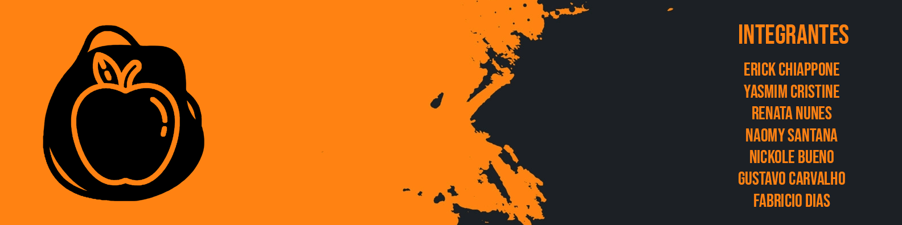

<h1 align="center">
  

</h1>

  

# IntegrationProjectFront-end

## :computer: Projeto
Uma plataforma de e-commerce que facilita os processos de doações entre empresas e ONGs. 
Com intuito de alcançar um publico que não realiza doações devido a processos e formulários longos e burocráticos, trazemos algo novo, removendo telas e formulários desnecessários, tornando-os simples, dinâmicos e intuitivos.

## :rocket: Tecnologias

As seguintes tecnologias foram utilizadas no desenvolvimento do projeto:

- [HTML](https://devdocs.io/html/)
- [CSS](https://devdocs.io/css/) 
- [REACT](https://devdocs.io/react/)
- [TYPESCRIPT](https://devdocs.io/typescript/)
### No front-end definimos uma paleta de cores em _hexadecimal:_
* E67E22
* F5F5F5
* 05c19c
* 331B3B

### Fontes utilizadas:
* Hind Vadodara
* Bebas Neue

### **INTEGRANTES DA APLICACAO:**

* Erick Chiappone
* Naomy Santana
* Gustavo Carvalho
* Renata Nunes
* Yasmim Cristine
* Nickole Bueno
* Fabricio Dias

Link com o Linkedin e GitHub de todos os participantes: <https://linktr.ee/GrupoDev2>

 

## :wrench: ACESSO:
Para rodar a aplicação, acesse: 

https://doaqui.vercel.app/